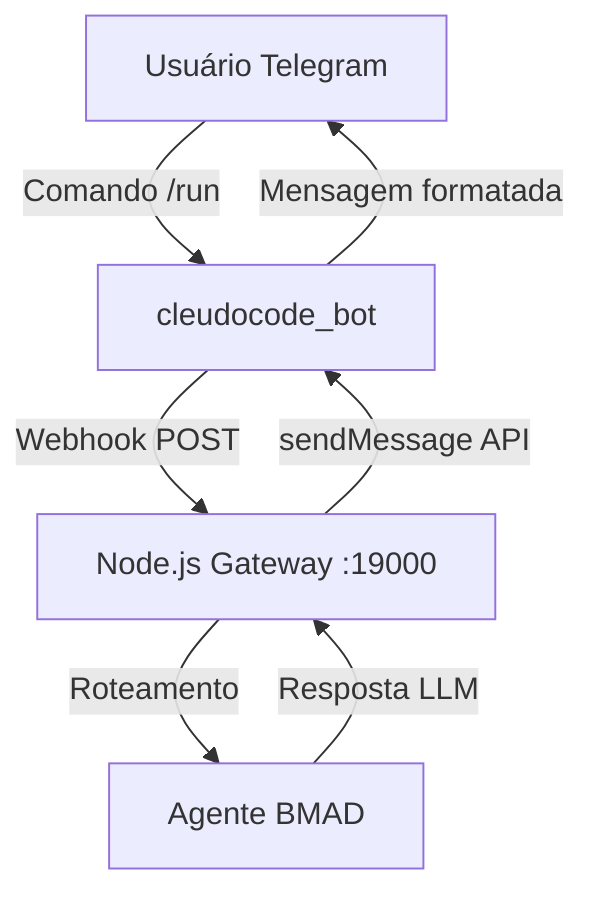

# BMAD + Telegram: Requisitos de Integração

**Gerado por:** @analyst — Cleudocode Hub BMAD Workflow  
**Data:** 2026-03-09  
**Bot:** @cleudocode_bot  
**Status:** 🔄 Aguardando @architect

---

## 1. Fluxos de Mensagens

### Casos de Uso

| Fluxo | Descrição | Payload | Estado |
|---|---|---|---|
| **Entrada** | Usuário envia msg ao @cleudocode_bot | `{"message": {"text": "/run pm", "from": {...}}}` | `received` |
| **Processamento** | Hub Node.js roteia para agente BMAD | `{"agent": "pm", "task": "..."}` | `processing` |
| **Resposta** | Agente responde via `sendMessage` | `{"chat_id": 123, "text": "..."}` | `sent` |
| **Callback** | Botão inline clicado | `{"callback_query": {"data": "run_workflow"}}` | `callback` |

### Diagrama de Fluxo



---

## 2. Comandos do Bot

| Comando | Agente | Descrição |
|---|---|---|
| `/run <agente> <tarefa>` | qualquer | Executa agente diretamente |
| `/workflow <tipo>` | orquestrador | Inicia workflow BMAD |
| `/status` | sistema | Status dos serviços |
| `/help` | sistema | Lista comandos |
| `/pm <tarefa>` | @pm | Atalho para o PM |
| `/dev <tarefa>` | @dev | Atalho para o Dev |
| `/qa <tarefa>` | @qa | Atalho para o QA |

---

## 3. Autenticação e Segurança

- **Token:** Via `@BotFather` — armazenado SOMENTE no `.env` (`TELEGRAM_BOT_TOKEN`)
- **Webhook:** Verificar `X-Telegram-Bot-Api-Secret-Token` (header HMAC)
- **Allowlist:** Aceitar apenas `chat_id` autorizados (configurável no `.env`)
- **Rate limit Telegram:** 30 msgs/segundo por bot, 20 por grupo/minuto

### Variáveis de Ambiente

```bash
TELEGRAM_BOT_TOKEN=        # Token do @BotFather (NUNCA hardcoded)
TELEGRAM_ALLOWED_USERS=    # IDs separados por vírgula (deixar vazio = todos)
TELEGRAM_WEBHOOK_SECRET=   # Secret para validar webhooks
```

---

## 4. Limitações Técnicas

| Limitação | Impacto | Mitigação |
|---|---|---|
| Timeout webhook 60s | Agentes lentos não respondem a tempo | Resposta imediata + streaming |
| Mensagem máx 4096 chars | Respostas longas truncadas | Dividir em múltiplas mensagens |
| Rate limit 30 msg/s | Fila de agentes sobrecarregada | Fila FIFO + retry |
| Sem E2E nativa (grupos) | Dados em grupos menos seguros | Usar apenas DM para dados sensíveis |

---

## 5. Arquitetura de Integração

```
/root/cleudocode-hub/
├── squads/
│   └── telegram-squad/
│       ├── bot.js          ← Servidor webhook Express
│       ├── router.js       ← Roteia comandos → agentes
│       ├── formatter.js    ← Formata Markdown para Telegram
│       └── SQUAD.md        ← Documentação do squad
```

### Stack

- **Bot API:** `node-telegram-bot-api` ou `grammy`
- **Webhook:** Express na porta `19001`
- **Comunicação com agentes:** chamada direta ao `llm-provider.js`
- **Streaming:** `sendChatAction("typing")` enquanto o LLM processa

---

## 6. Próximos Passos

- [ ] **@architect:** Definir estrutura do `telegram-squad/` e ADR para grammy vs node-telegram-bot-api
- [ ] **@dev:** Implementar `bot.js` + `router.js`
- [ ] **@qa:** Testar comandos e rate limits
- [ ] **@devops:** Configurar webhook via `setWebhook` no deploy
