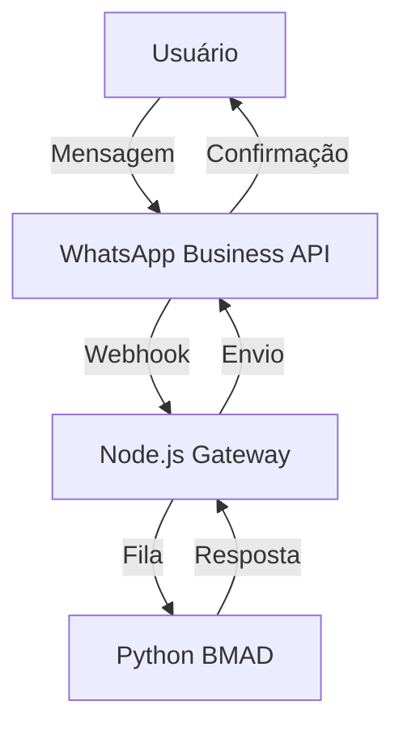

# Workflow BMAD: bmad
**Requisito:** # BMAD + WhatsApp: Requisitos de Integração

**Gerado por:** @analyst — Cleudocode Hub BMAD Workflow  
**Data:** 2026-03-09  
**Status:** ✅ Aprovado pelo @analyst | 🔄 Aguardando @dev e @qa

---

## 1. Fluxos de Mensagens

### Casos de Uso

| Fluxo | Descrição | Exemplo de Payload | Estado |
|---|---|---|---|
| **Entrada de Mensagem** | Usuário envia mensagem via WhatsApp | `{"from": "5511999999999", "text": "Olá"}` | `received` |
| **Processamento** | BMAD (Python) processa (NLP, regras) | `{"intent": "saudacao", "confidence": 0.95}` | `processing` |
| **Resposta** | BMAD envia resposta via WhatsApp API | `{"to": "5511999999999", "text": "Bem-vindo!"}` | `sent` |
| **Notificação** | WhatsApp confirma entrega (webhook) | `{"status": "delivered", "timestamp": "..."}` | `delivered` |

### Diagrama de Fluxo



### Requisitos Funcionais

1. Suporte a tipos: texto, imagens, documentos, localização, botões interativos
2. Rastrear estados: `received → processing → sent → delivered | failed`
3. Escalabilidade: processar 100+ mensagens/segundo (fila obrigatória)

---

## 2. Autenticação e Segurança

- **Token de Acesso:** JWT ou API Key (WhatsApp)
- **Webhooks:** Assinatura via `X-Hub-Signature` (HMAC-SHA256)
- **Criptografia:** E2E nativa (não gerenciável pela API)
- **LGPD/GDPR:** Armazenar apenas metadados — nunca conteúdo das mensagens

### Requisitos Não-Funcionais

1. Tokens rotativos a cada 24h (cron job automatizado)
2. Rate limit: 80 mensagens/segundo por número
3. Logs de auditoria completos para compliance

---

## 3. Limitações Técnicas

| Limitação | Impacto | Mitigação |
|---|---|---|
| Rate Limit (80 msg/s) | Perda de mensagens | Fila de prioridade + retry exponencial |
| Payload Máximo (64KB) | Limita arquivos grandes | Compressão ou links externos |
| Webhooks não confiáveis | Eventos perdidos | Polling periódico para pendentes |
| Sem suporte a grupos | API Business não permite | Comunicar limitação |
| Dependência de número | Rate limit por número | Escalar números conforme demanda |

---

## 4. Soluções Propostas

### Bridge Python ↔ Node.js (RFC-003)

**Tecnologia recomendada:** gRPC (baixa latência) ou RabbitMQ (fila persistente)

```protobuf
// whatsapp.proto
service WhatsAppService {
  rpc ProcessMessage (MessageRequest) returns (MessageResponse);
}

message MessageRequest {
  string from = 1;
  string text = 2;
  string media_url = 3;
}

message MessageResponse {
  string to = 1;
  string text = 2;
  bool success = 3;
}
```

### Filas

| Fila | Direção | Descrição |
|---|---|---|
| `whatsapp_inbound` | WhatsApp → BMAD | Mensagens recebidas |
| `whatsapp_outbound` | BMAD → WhatsApp | Mensagens para enviar |

### Persistência

- **PostgreSQL** — dados estruturados (conversas, logs, métricas)
- **Redis** — cache de estados de sessão

---

## 5. Riscos e Mitigações

| Risco | Probabilidade | Impacto | Mitigação |
|---|---|---|---|
| WhatsApp bloquear número | Média | Alto | Monitorar rate limits + números dedicados |
| Falha no bridge Python↔Node.js | Alta | Médio | Health checks + fallback para fila |
| Mensagens duplicadas | Baixa | Baixo | ID único + deduplicação |
| Vazamento de dados (LGPD) | Baixa | Crítico | Criptografar + logs anonimizados |

---

## 6. Próximos Passos

- [ ] **@dev:** Arquitetura detalhada → `docs/ucm/bmad_whatsapp/architecture.md`
- [ ] **@qa:** Revisão de requisitos → `docs/ucm/bmad_whatsapp/qa_review.md`
- [ ] **@architect:** ADR para bridge gRPC vs RabbitMQ
- [ ] **@pm:** Cronograma e backlog

---

## 7. Referências

- [WhatsApp Business API Docs](https://developers.facebook.com/docs/whatsapp/cloud-api/)
- [gRPC vs RabbitMQ](https://blog.rabbitmq.com/posts/2021/05/rabbitmq-and-grpc/)
- [LGPD Compliance Guide](https://www.gov.br/cidadania/pt-br/acesso-a-informacao/lgpd)
**Data:** 09/03/2026, 17:45:47
**Provider:** ollama

---

## Requisito Original
# BMAD + WhatsApp: Requisitos de Integração

**Gerado por:** @analyst — Cleudocode Hub BMAD Workflow  
**Data:** 2026-03-09  
**Status:** ✅ Aprovado pelo @analyst | 🔄 Aguardando @dev e @qa

---

## 1. Fluxos de Mensagens

### Casos de Uso

| Fluxo | Descrição | Exemplo de Payload | Estado |
|---|---|---|---|
| **Entrada de Mensagem** | Usuário envia mensagem via WhatsApp | `{"from": "5511999999999", "text": "Olá"}` | `received` |
| **Processamento** | BMAD (Python) processa (NLP, regras) | `{"intent": "saudacao", "confidence": 0.95}` | `processing` |
| **Resposta** | BMAD envia resposta via WhatsApp API | `{"to": "5511999999999", "text": "Bem-vindo!"}` | `sent` |
| **Notificação** | WhatsApp confirma entrega (webhook) | `{"status": "delivered", "timestamp": "..."}` | `delivered` |

### Diagrama de Fluxo


### Requisitos Funcionais

1. Suporte a tipos: texto, imagens, documentos, localização, botões interativos
2. Rastrear estados: `received → processing → sent → delivered | failed`
3. Escalabilidade: processar 100+ mensagens/segundo (fila obrigatória)

---

## 2. Autenticação e Segurança

- **Token de Acesso:** JWT ou API Key (WhatsApp)
- **Webhooks:** Assinatura via `X-Hub-Signature` (HMAC-SHA256)
- **Criptografia:** E2E nativa (não gerenciável pela API)
- **LGPD/GDPR:** Armazenar apenas metadados — nunca conteúdo das mensagens

### Requisitos Não-Funcionais

1. Tokens rotativos a cada 24h (cron job automatizado)
2. Rate limit: 80 mensagens/segundo por número
3. Logs de auditoria completos para compliance

---

## 3. Limitações Técnicas

| Limitação | Impacto | Mitigação |
|---|---|---|
| Rate Limit (80 msg/s) | Perda de mensagens | Fila de prioridade + retry exponencial |
| Payload Máximo (64KB) | Limita arquivos grandes | Compressão ou links externos |
| Webhooks não confiáveis | Eventos perdidos | Polling periódico para pendentes |
| Sem suporte a grupos | API Business não permite | Comunicar limitação |
| Dependência de número | Rate limit por número | Escalar números conforme demanda |

---

## 4. Soluções Propostas

### Bridge Python ↔ Node.js (RFC-003)

**Tecnologia recomendada:** gRPC (baixa latência) ou RabbitMQ (fila persistente)

```protobuf
// whatsapp.proto
service WhatsAppService {
  rpc ProcessMessage (MessageRequest) returns (MessageResponse);
}

message MessageRequest {
  string from = 1;
  string text = 2;
  string media_url = 3;
}

message MessageResponse {
  string to = 1;
  string text = 2;
  bool success = 3;
}
```

### Filas

| Fila | Direção | Descrição |
|---|---|---|
| `whatsapp_inbound` | WhatsApp → BMAD | Mensagens recebidas |
| `whatsapp_outbound` | BMAD → WhatsApp | Mensagens para enviar |

### Persistência

- **PostgreSQL** — dados estruturados (conversas, logs, métricas)
- **Redis** — cache de estados de sessão

---

## 5. Riscos e Mitigações

| Risco | Probabilidade | Impacto | Mitigação |
|---|---|---|---|
| WhatsApp bloquear número | Média | Alto | Monitorar rate limits + números dedicados |
| Falha no bridge Python↔Node.js | Alta | Médio | Health checks + fallback para fila |
| Mensagens duplicadas | Baixa | Baixo | ID único + deduplicação |
| Vazamento de dados (LGPD) | Baixa | Crítico | Criptografar + logs anonimizados |

---

## 6. Próximos Passos

- [ ] **@dev:** Arquitetura detalhada → `docs/ucm/bmad_whatsapp/architecture.md`
- [ ] **@qa:** Revisão de requisitos → `docs/ucm/bmad_whatsapp/qa_review.md`
- [ ] **@architect:** ADR para bridge gRPC vs RabbitMQ
- [ ] **@pm:** Cronograma e backlog

---

## 7. Referências

- [WhatsApp Business API Docs](https://developers.facebook.com/docs/whatsapp/cloud-api/)
- [gRPC vs RabbitMQ](https://blog.rabbitmq.com/posts/2021/05/rabbitmq-and-grpc/)
- [LGPD Compliance Guide](https://www.gov.br/cidadania/pt-br/acesso-a-informacao/lgpd)
