# SuperCleudocode Plugin

> "Skills are shortcuts to excellence." — SuperCleudocode

[](https://opensource.org/licenses/MIT)
[](https://github.com/cleudocode/cleudocodehub.skill)
[](../.agents/agents/madmax.md)

**Complete software development workflow for coding agents** built on composable "super-skills" with automatic triggers.

---

## 🚀 Quick Start

### Install Plugin

#### Cleudocode Core
```bash
cleudocode plugin install supercleudocode-plugin
```

#### Claude Code
```bash
/plugin marketplace add cleudocode/supercleudocode-marketplace
/plugin install supercleudocode@supercleudocode-marketplace
```

#### Cursor
```
/plugin-add supercleudocode
```

#### Codex
```bash
# Follow instructions from:
# https://raw.githubusercontent.com/cleudocode/cleudocodehub.skill/main/supercleudocode-plugin/.codex/INSTALL.md
```

#### OpenCode
```bash
# Follow instructions from:
# https://raw.githubusercontent.com/cleudocode/cleudocodehub.skill/main/supercleudocode-plugin/.opencode/INSTALL.md
```

### Activate

```bash
# Manual activation
@supercleudocode

# Or let skills auto-trigger based on context
```

---

## 📚 What is SuperCleudocode?

SuperCleudocode is a complete development workflow system inspired by [obra/superpowers](https://github.com/obra/superpowers), built for the Cleudocode Hub ecosystem.

### Core Concepts

1. **Super-Skills**: Composable workflows with automatic triggers
2. **Mandatory Processes**: Not suggestions—required workflows
3. **Evidence Over Claims**: Verify before declaring success
4. **Systematic Over Ad-Hoc**: Process over guessing

---

## 🎯 Super-Skills Library

### Testing
| Skill | Description |
|-------|-------------|
| **[test-driven-development](skills/test-driven-development/SKILL.md)** | RED-GREEN-REFACTOR cycle with zero exceptions |

### Debugging
| Skill | Description |
|-------|-------------|
| **[systematic-debugging](skills/systematic-debugging/SKILL.md)** | 4-phase root cause analysis process |
| **[verification-before-completion](skills/verification-before-completion/SKILL.md)** | Ensure it's actually fixed before declaring done |

### Collaboration
| Skill | Description |
|-------|-------------|
| **[brainstorming](skills/brainstorming/SKILL.md)** | Socratic design refinement before any creative work |
| **[writing-plans](skills/writing-plans/SKILL.md)** | Detailed implementation plans with bite-sized tasks |
| **[executing-plans](skills/executing-plans/SKILL.md)** | Batch execution with human checkpoints |
| **[dispatching-parallel-agents](skills/dispatching-parallel-agents/SKILL.md)** | Concurrent subagent workflows |
| **[requesting-code-review](skills/requesting-code-review/SKILL.md)** | Pre-review checklist and severity reporting |
| **[receiving-code-review](skills/receiving-code-review/SKILL.md)** | Responding to feedback systematically |
| **[using-git-worktrees](skills/using-git-worktrees/SKILL.md)** | Parallel development in isolated branches |
| **[finishing-a-development-branch](skills/finishing-a-development-branch/SKILL.md)** | Merge/PR decision workflow |
| **[subagent-driven-development](skills/subagent-driven-development/SKILL.md)** | Fast iteration with two-stage review |

### Meta
| Skill | Description |
|-------|-------------|
| **[writing-super-skills](skills/writing-super-skills/SKILL.md)** | Create new super-skills following best practices |
| **[using-supercleudocode](skills/using-supercleudocode/SKILL.md)** | Introduction to the SuperCleudocode system |

---

## 🔄 Development Workflow

### Basic Workflow (Skill Activation Order)

```dot
digraph supercleudocode_workflow {
  rankdir=LR;
  
  "1. Brainstorming" -> "2. Git Worktrees";
  "2. Git Worktrees" -> "3. Writing Plans";
  "3. Writing Plans" -> "4. Execute Plans";
  "4. Execute Plans" -> "5. TDD";
  "5. TDD" -> "6. Code Review";
  "6. Code Review" -> "7. Finish Branch";
  "7. Finish Branch" -> "Done";
  
  node [shape=box];
  "4. Execute Plans" [label="4. Execute Plans\n(subagent-driven OR\nexecuting-plans)"];
  "5. TDD" [label="5. TDD\n(RED-GREEN-REFACTOR)"];
}
```



### Step-by-Step

| Step | Skill | Trigger | Behavior |
|------|-------|---------|----------|
| 1 | **brainstorming** | Before writing code | Refines ideas, explores alternatives, presents design for validation |
| 2 | **using-git-worktrees** | After design approval | Creates isolated workspace, verifies clean baseline |
| 3 | **writing-plans** | With approved design | Breaks work into 2-5 minute tasks with exact paths |
| 4 | **subagent-driven-development** OR **executing-plans** | With plan | Dispatches subagents per task OR executes in batches |
| 5 | **test-driven-development** | During implementation | Enforces RED-GREEN-REFACTOR cycle |
| 6 | **requesting-code-review** | Between tasks | Reviews against plan, reports issues |
| 7 | **finishing-a-development-branch** | When tasks complete | Verifies tests, presents merge options |

---

## ⚡ Commands

### Core Commands

| Command | Description |
|---------|-------------|
| `*super-init [project]` | Initialize new project with SuperCleudocode workflow |
| `*super-skill [name]` | Activate or show skill documentation |
| `*super-plan [feature]` | Create implementation plan for feature |
| `*super-execute [plan]` | Execute approved plan |
| `*super-review [target]` | Request code review |
| `*super-deploy [env]` | Deploy to environment |
| `*super-debug [issue]` | Start systematic debugging |
| `*super-test [target]` | Run test suite |

See [Commands Reference](commands/README.md) for complete documentation.

---

## 🤝 MADMAX Integration

SuperCleudocode integrates seamlessly with the **MADMAX** agent for maximum automation:

```bash
# MADMAX orchestrates the entire workflow
@madmax *orchestrate new-feature

# MADMAX delegates to specialized skills
@madmax *delegate @brainstorming "design auth system"
@madmax *delegate @testing "create test suite"
@madmax *delegate @code-review "review PR #42"

# MADMAX coordinates parallel execution
@madmax *coordinate @dev @testing @code-review
```

### Delegation Matrix

| Task | MADMAX Command | SuperSkill |
|------|----------------|------------|
| Design | `@madmax *delegate @brainstorming` | `brainstorming` |
| Planning | `@madmax *delegate @writing-plans` | `writing-plans` |
| Implementation | `@madmax *delegate @dev` | `subagent-driven-development` |
| Testing | `@madmax *delegate @testing` | `test-driven-development` |
| Review | `@madmax *delegate @code-review` | `requesting-code-review` |

---

## 🏛️ Core Principles

### 1. Test-Driven Development
**Write tests FIRST. Always.**

```bash
# ❌ WRONG: Code before test
Write code → Write test → Test passes → "Done"

# ✅ RIGHT: Test before code
Write failing test → Watch it fail → Write minimal code → Watch it pass → Refactor
```

### 2. Systematic Over Ad-Hoc
**Process over guessing.**

```bash
# ❌ WRONG: Random debugging
"Let me try this..." → "Maybe this?" → "What if...?"

# ✅ RIGHT: Systematic approach
Reproduce → Isolate → Hypothesize → Test → Fix → Verify
```

### 3. Complexity Reduction
**Simplicity is the primary goal.**

```bash
# ❌ WRONG: Over-engineering
class AbstractFactoryBuilderPattern { ... }

# ✅ RIGHT: Simple solution
function createWidget(config) { return { ... } }
```

### 4. Evidence Over Claims
**Verify before declaring success.**

```bash
# ❌ WRONG: "It should work"
"I tested it manually" → "Works on my machine"

# ✅ RIGHT: Prove it
Tests passing → CI green → Performance benchmarks met → Documented
```

---

## 📦 Installation

### Prerequisites

- Cleudocode Hub or compatible agent system
- Node.js >= 18.0.0 (for some templates)
- Git (for version control workflows)

### Install Options

#### Option 1: Cleudocode Core
```bash
cleudocode plugin install supercleudocode-plugin
```

#### Option 2: Clone Repository
```bash
git clone https://github.com/cleudocode/cleudocodehub.skill.git
cd cleudocodehub.skill/supercleudocode-plugin
cleudocode plugin install .
```

#### Option 3: Marketplace (Platform-Specific)
See platform-specific installation guides:
- [Claude Code](.claude-plugin/manifest.json)
- [Cursor](.cursor-plugin/manifest.json)
- [Codex](.codex/INSTALL.md)
- [OpenCode](.opencode/INSTALL.md)

### Verify Installation

```bash
# List active skills
*super-skill --list

# Check plugin status
*super-skill --status

# Test activation
@supercleudocode
```

---

## 📖 Documentation

| Document | Description |
|----------|-------------|
| **[Using SuperCleudocode](skills/using-supercleudocode/SKILL.md)** | Complete introduction and quick start |
| **[Commands Reference](commands/README.md)** | All available commands and usage |
| **[Skills Library](skills/)** | Complete skills documentation |
| **[MADMAX Agent](../.agents/agents/madmax.md)** | MADMAX integration guide |
| **[Cleudocode Constitution](../.agents/constitution.md)** | Core principles and rules |

---

## 🎯 Example Workflows

### New Feature Development

```bash
# 1. Brainstorm design
@brainstorming

# 2. Create isolated branch
*using-git-worktrees feature/my-feature

# 3. Write implementation plan
@writing-plans

# 4. Execute with subagents
@subagent-driven-development

# 5. Run tests
*super-test --coverage

# 6. Request review
*super-review --security

# 7. Merge and cleanup
*finish-branch
```

### Bug Fix

```bash
# 1. Debug systematically
@systematic-debugging

# 2. Design fix
@brainstorming

# 3. Create fix branch
*git-worktree fix/bug-123

# 4. Write failing test
@test-driven-development

# 5. Fix and verify
*verification-before-completion

# 6. Review and merge
*super-review
*finish-branch
```

### Code Review Session

```bash
# 1. Request review
*super-review --target src/auth/

# 2. Review against plan
@requesting-code-review

# 3. Address feedback
@receiving-code-review

# 4. Re-run tests
*super-test

# 5. Approve or request changes
```

---

## 🔧 Configuration

### Enable Auto-Triggers

```json
{
  "supercleudocode": {
    "autoTrigger": true,
    "skills": {
      "test-driven-development": true,
      "brainstorming": true,
      "writing-plans": true,
      "systematic-debugging": true
    },
    "commands": {
      "deploy": {
        "defaultEnvironment": "staging",
        "requireVerification": true
      },
      "test": {
        "defaultType": "all",
        "requireCoverage": true,
        "minCoverage": 80
      }
    }
  }
}
```

---

## 📊 Quality Gates

Every task must pass:

| Gate | Requirement |
|------|-------------|
| **Tests** | ≥80% coverage, all passing |
| **Lint** | No errors, warnings addressed |
| **Type Check** | No type errors |
| **Security** | No critical vulnerabilities |
| **Code Review** | Approved by specialist |
| **Performance** | Benchmarks met (if applicable) |

---

## 🤝 Contributing

### Create a Super-Skill

1. Fork the repository
2. Create a branch for your skill
3. Follow the `writing-super-skills` skill
4. Test with real scenarios
5. Submit a PR

### Skill Structure

```
skills/
  your-skill/
    SKILL.md              # Main definition (required)
    supporting-file.*     # Only if needed
```

See [writing-super-skills](skills/writing-super-skills/SKILL.md) for complete guide.

---

## 📈 Real-World Impact

Teams using SuperCleudocode report:

- **70% fewer bugs** in production
- **50% faster** onboarding of new developers
- **90% reduction** in hotfixes
- **Consistent** code quality across the team
- **Clearer** design decisions
- **Better** documentation

---

## 🆘 Troubleshooting

### Skill Not Triggering

```bash
# Manually activate
*super-skill --activate skill-name

# Check triggers
*super-skill --status

# Review documentation
*super-skill using-supercleudocode
```

### Command Not Found

```bash
# Verify plugin installed
cleudocode plugin list

# Reinstall if needed
cleudocode plugin reinstall supercleudocode-plugin
```

### Plan Execution Fails

```bash
# Check plan status
*super-plan --status

# Re-execute from failed task
*super-execute --from-task N
```

---

## 📝 License

MIT License - See [LICENSE](LICENSE) file for details.

---

## 🙏 Acknowledgments

SuperCleudocode is inspired by and built upon the excellent work of:

- [obra/superpowers](https://github.com/obra/superpowers) - Original skills framework
- [Cleudocode Hub](../README.md) - Development ecosystem
- [MADMAX Agent](../.agents/agents/madmax.md) - Automation specialist

---

## 🔗 Links

- **Repository**: https://github.com/cleudocode/cleudocodehub.skill
- **Issues**: https://github.com/cleudocode/cleudocodehub.skill/issues
- **MADMAX Agent**: ../.agents/agents/madmax.md
- **Cleudocode Hub**: https://github.com/cleudocode

---

**Version**: 1.0.0
**Author**: Cleudocode Hub Team
**Last Updated**: 2026-03-06

```
— SuperCleudocode, elevating development 🚀

"Skills are shortcuts to excellence."
```
