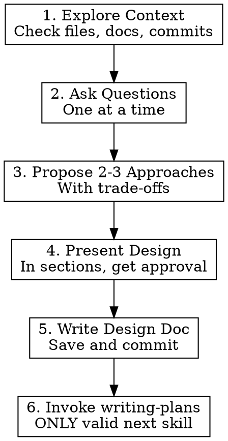

# Brainstorming

## Overview

**Brainstorming** is a Socratic design refinement process that MUST happen before ANY creative work.

**Core Principle:** Understand the WHY before designing the HOW.

## When to Use

### ALWAYS Use Brainstorming Before:
- Creating new features
- Building components
- Adding functionality
- Modifying existing behavior
- Refactoring code
- Making architectural decisions
- Starting any project

### When NOT to Use
- Trivial changes (typo fixes, comment updates)
- Emergency hotfixes (use `systematic-debugging` first, then brainstorm post-mortem)
- Following explicit, detailed instructions

## The Process



## Checklist (Complete In Order)

1. **Explore project context** — Check files, documentation, recent commits
2. **Ask clarifying questions** — One at a time, understand purpose/constraints/success
3. **Propose 2-3 approaches** — With trade-offs and your recommendation
4. **Present design** — In sections scaled to complexity, get approval after each
5. **Write design doc** — Save to `docs/plans/YYYY-MM-DD--design.md` and commit
6. **Transition to implementation** — Invoke `writing-plans` skill (ONLY valid next skill)

## Rules

### Mandatory Rules

- **MUST** present design and get user approval before ANY implementation
- **MUST** ask questions one at a time (only one question per message)
- **MUST** propose 2-3 approaches with trade-offs
- **MUST** invoke ONLY `writing-plans` skill after brainstorming
  - NOT `frontend-design`, `mcp-builder`, or any other implementation skill
- **MUST** complete checklist items in order

### Process Rules

- Prefer multiple choice questions over open-ended when possible
- Scale design sections to complexity:
  - Simple: Few sentences
  - Nuanced: 200-300 words
- Get user approval after each design section
- Apply to EVERY project regardless of perceived simplicity
- Ruthlessly apply YAGNI (You Aren't Gonna Need It)

### Anti-Pattern to Avoid

**"This Is Too Simple To Need A Design"**

All projects require this process. "Simple" projects often have hidden complexity.

## Implementation Pattern

### Phase 1: Understanding

```
Check project state → Ask questions (one at a time)
Focus on: purpose, constraints, success criteria
```

**Example Questions:**
- "What problem are you really trying to solve?"
- "Who will use this and in what context?"
- "What does success look like?"
- "Are there any constraints I should know about?"
- "What's the timeline or priority?"

### Phase 2: Exploration

```
Propose 2-3 approaches → Present trade-offs → Give recommendation
```

**Example:**

> **Approach 1: Simple Function**
> - Create a pure function that takes input and returns output
> - Pros: Simple, testable, easy to understand
> - Cons: May not scale if requirements grow
> 
> **Approach 2: Class-Based Service**
> - Create a service class with dependency injection
> - Pros: More flexible, easier to extend, better for testing
> - Cons: More boilerplate, overkill for simple use cases
> 
> **Approach 3: Functional with Composition**
> - Use function composition and currying
> - Pros: Highly composable, functional purity
> - Cons: May be unfamiliar to team, harder to debug
> 
> **My Recommendation:** Approach 1 for now. We can refactor to Approach 2 if requirements grow. YAGNI.

### Phase 3: Validation

```
Present design sections → Get approval per section → Revise if needed
```

**Design Sections:**

1. **Purpose & Goals** (What and Why)
2. **Scope** (What's in, what's out)
3. **Architecture** (High-level structure)
4. **Data Flow** (How data moves)
5. **Interfaces** (APIs, components)
6. **Testing Strategy** (How we'll test)
7. **Risks & Mitigations** (What could go wrong)

### Phase 4: Documentation

```
Write design doc → Save to docs/plans/ → Commit
```

**Template:**

```markdown
# Design: Feature Name

**Date:** YYYY-MM-DD
**Author:** Your Name
**Status:** Approved

## Purpose
Why are we doing this?

## Goals
What are we trying to achieve?

## Scope
### In Scope
- Feature 1
- Feature 2

### Out of Scope
- Future enhancement 1
- Future enhancement 2

## Design
### Architecture
[Diagram or description]

### Data Flow
[How data moves through the system]

### Interfaces
[APIs, components, contracts]

## Alternatives Considered
1. Approach A - Why not chosen
2. Approach B - Why not chosen

## Testing Strategy
How will we verify this works?

## Risks
What could go wrong and how we'll mitigate

## Open Questions
Unresolved decisions
```

### Phase 5: Transition

```
Invoke writing-plans skill (ONLY valid next skill)
```

**Do NOT invoke:**
- `frontend-design`
- `mcp-builder`
- Any implementation skill

**ONLY invoke:**
- `writing-plans`

## Question Techniques

### Multiple Choice (Preferred)

```
"Should we use:
A) Local storage (simple, but limited)
B) IndexedDB (more complex, more powerful)
C) Server-side storage (requires API changes)

My recommendation: A for now. We can migrate later if needed."
```

### Single Question

```
"What's the primary goal: performance, maintainability, or speed of delivery?"
```

### Avoid

```
❌ "What do you want to do?" (Too open-ended)
❌ "Should we do X or Y or Z or A or B or...?" (Too many options)
❌ "How should this work?" (Too vague)
```

## Design Presentation

### Scale to Complexity

**Simple Feature (Few Sentences):**

> **Design: Add User Logout**
> 
> 1. Add logout button to header (visible when logged in)
> 2. On click: clear auth token, redirect to home
> 3. Update nav state to show logged out
> 
> This matches the existing auth pattern. OK to proceed?

**Complex Feature (200-300 Words per Section):**

> **Design: Real-Time Notification System**
> 
> ### Architecture
> 
> We'll use a pub-sub pattern with WebSocket for real-time updates. The frontend will maintain a persistent connection to a notification service, which will push updates when events occur.
> 
> **Components:**
> - `NotificationService` (manages WebSocket connection)
> - `NotificationStore` (Redux store for notification state)
> - `NotificationCenter` (UI component for displaying notifications)
> - `NotificationAPI` (backend service for persistence)
> 
> **Data Flow:**
> 1. Backend event occurs (e.g., new message)
> 2. Event published to notification service
> 3. Service pushes to connected clients via WebSocket
> 4. Frontend store updates
> 5. UI re-renders with new notification
> 
> This approach balances real-time capability with offline support (notifications are persisted and synced on reconnect).
> 
> OK to proceed with this architecture?

## Common Mistakes

| Mistake | Fix |
|---------|-----|
| Asking multiple questions at once | Ask ONE question, wait for answer |
| Skipping design approval | Get explicit approval before proceeding |
| Invoking wrong skill after | ONLY invoke `writing-plans` |
| Over-engineering | Apply YAGNI ruthlessly |
| Under-documenting | Write design doc even for "simple" features |
| Not exploring alternatives | Always propose 2-3 approaches |

## Real-World Impact

Teams using structured brainstorming report:

- **60% fewer** redesigns mid-implementation
- **40% faster** implementation (clear plan from start)
- **Better alignment** between stakeholders
- **Clearer handoffs** between team members

## Integration with Other Skills

### Before Brainstorming
- None - this is the starting point

### After Brainstorming
- `writing-plans` (ONLY valid next skill)
- `using-git-worktrees` (after plans, for isolated development)

### Related Skills
- `writing-plans` - Break design into tasks
- `executing-plans` - Implement the plan
- `subagent-driven-development` - Dispatch subagents per task

## Example Session

### User Request
"I need a user profile page."

### Agent Response (Brainstorming)

> **Step 1: Explore Context**
> 
> Let me check the existing codebase to understand the current structure...
> 
> [Checks files, finds existing auth system, UI components, routing]
> 
> **Step 2: Ask Questions**
> 
> What information should users be able to see/edit on their profile?
> 
> A) Basic info only (name, email, avatar)
> B) Basic + preferences (theme, notifications)
> C) Full profile (bio, social links, custom fields)
> 
> **Step 3: After User Answers...**
> 
> **Propose Approaches:**
> 
> **Approach 1: Simple Page**
> - Single component with form
> - Direct API calls
> - Pros: Fast, simple
> - Cons: Hard to reuse, test
> 
> **Approach 2: Modular with Service**
> - Separate components (ProfileForm, AvatarUpload, etc.)
> - ProfileService for API calls
> - Pros: Reusable, testable, maintainable
> - Cons: More initial setup
> 
> **Recommendation:** Approach 2. Matches existing patterns, easier to extend.
> 
> **Step 4: Present Design**
> 
> [Presents design in sections, gets approval]
> 
> **Step 5: Write Design Doc**
> 
> [Saves to `docs/plans/2026-03-06--user-profile-design.md`]
> 
> **Step 6: Invoke Next Skill**
> 
> Now invoking `writing-plans` to break this into implementation tasks.

## Red Flags

- User says "just start coding" → Explain why design first
- "We don't have time for this" → We don't have time NOT to
- "I already know what I want" → Still validate understanding
- "This is too simple" → Simple things break too

## Final Rule

**No implementation before design approval.**

Code written before design approval? **Delete it. Start over.**

---

**Next Skill:** `writing-plans` (ONLY)

**Version**: 1.0.0
**License**: MIT
