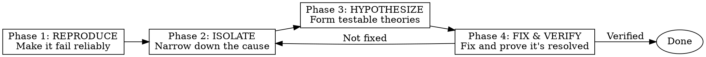

# Systematic Debugging

## Overview

**Systematic Debugging** is a structured 4-phase process for finding root causes.

**Core Principle:** Evidence over guessing. Process over ad-hoc attempts.

## When to Use

### ALWAYS Use Systematic Debugging When:
- Investigating bugs
- Troubleshooting unexpected behavior
- Fixing production issues
- Debugging flaky tests
- Resolving performance problems
- Tracking down race conditions

### When NOT to Use
- Simple syntax errors (compiler tells you)
- Obvious typos
- Clear error messages with direct fixes

## The 4-Phase Process



## Phase 1: REPRODUCE

### Goal
Make the failure happen reliably and consistently.

### Steps

1. **Gather Information**
   - Error messages (full stack trace)
   - Logs (before, during, after failure)
   - User reports (what were they doing?)
   - Environment (OS, browser, versions)

2. **Identify Conditions**
   - When does it fail?
   - When does it NOT fail?
   - What triggers the failure?
   - Is it timing-dependent?

3. **Create Minimal Reproduction**
   - Smallest input that triggers failure
   - Simplest environment where it fails
   - Automated test if possible

### Questions to Answer

```
□ What exact error occurs?
□ What steps trigger the failure?
□ Does it fail every time with these steps?
□ What environment does it fail in?
□ Are there any patterns (time of day, load, etc.)?
```

### Example

```typescript
// ❌ Bad: Vague report
"Sometimes the app crashes"

// ✅ Good: Reproducible
"App crashes when:
1. User logs in
2. Navigates to /dashboard
3. Refreshes page within 2 seconds
Error: TypeError: Cannot read property 'user' of null
Stack: DashboardComponent.tsx:42"
```

### Output of Phase 1

```markdown
## Reproduction Steps

1. [Step 1]
2. [Step 2]
3. [Step 3]

## Expected
[What should happen]

## Actual
[What actually happens, with full error]

## Environment
- OS: [version]
- Browser/Node: [version]
- App Version: [version]
```

## Phase 2: ISOLATE

### Goal
Narrow down the root cause to the smallest possible scope.

### Techniques

#### 1. Divide and Conquer

```
System → Module → Component → Function → Line
```

Add logging/assertions at each level to narrow down.

#### 2. Binary Search (Git)

```bash
# Find when bug was introduced
git bisect start
git bisect bad          # Current version has bug
git bisect good v1.0.0  # Earlier version works
# Git will checkout commits - test each
git bisect reset        # When done
```

#### 3. Dependency Isolation

```bash
# Test without external dependencies
# Mock APIs, databases, file systems

# Example: Isolate database issue
// Before: Component → API → Database
// After:  Component → MockAPI (no database)
```

#### 4. Condition Variation

```
Test with different:
- Input values (empty, null, max, min)
- Timing (fast, slow, concurrent)
- State (fresh, cached, corrupted)
- Environment (dev, staging, prod)
```

### Tools

| Tool | Use For |
|------|---------|
| `console.log` / logger | Trace execution flow |
| Debugger | Step through code |
| `git bisect` | Find introducing commit |
| Profiler | Performance issues |
| Network tab | API/HTTP issues |
| Database logs | Query issues |

### Example

```typescript
// Bug: User data sometimes null in Dashboard

// Step 1: Add logging
useEffect(() => {
  console.log('Dashboard render', { user, loading, error })
  // Shows: user is null on fast refresh
}, [user, loading, error])

// Step 2: Trace data flow
// Dashboard gets user from AuthContext
// Check AuthContext...
console.log('AuthContext', contextValue)
// Shows: context resets on fast refresh

// Step 3: Isolate to specific code
// Found: useEffect cleanup race condition
```

### Output of Phase 2

```markdown
## Isolation Results

### Scope
- Module: [name]
- Component: [name]
- Function: [name]

### Root Cause Location
File: [path]
Lines: [start-end]

### Conditions
- Fails when: [condition]
- Works when: [condition]

### Related Code
[Code snippet showing the issue]
```

## Phase 3: HYPOTHESIZE

### Goal
Form testable theories about the root cause.

### Technique: Root Cause Tracing

```
Symptom → Direct Cause → Underlying Cause → Root Cause
```

**Example:**

```
Symptom:        Dashboard shows "Loading..." forever
Direct Cause:   loading state never becomes false
Underlying:     useEffect cleanup runs before fetch completes
Root Cause:     Missing abort controller for fetch
```

### Technique: 5 Whys

```
Problem: App crashes on refresh

1. Why? → user is null
2. Why? → AuthContext doesn't have user
3. Why? → useEffect cleanup cleared it
4. Why? → Cleanup runs before fetch completes
5. Why? → No abort controller for fetch ← ROOT CAUSE
```

### Technique: Defense in Depth

Consider multiple layers of defense:

```
Layer 1: Prevent the bug (validation, types)
Layer 2: Catch the bug early (assertions, tests)
Layer 3: Mitigate the bug (error boundaries, fallbacks)
Layer 4: Detect the bug (monitoring, alerts)
```

### Form Hypotheses

```markdown
## Hypothesis 1 (Most Likely)
**Cause:** [description]
**Evidence:** [supporting observations]
**Test:** [how to confirm/deny]

## Hypothesis 2
**Cause:** [description]
**Evidence:** [supporting observations]
**Test:** [how to confirm/deny]

## Hypothesis 3
**Cause:** [description]
**Evidence:** [supporting observations]
**Test:** [how to confirm/deny]
```

### Example

```markdown
## Hypothesis 1 (Most Likely)
**Cause:** Race condition in useEffect cleanup
**Evidence:** 
- Only happens on fast refresh
- Console shows cleanup before fetch complete
- Doesn't happen with slow refresh
**Test:** Add abort controller, verify fix

## Hypothesis 2
**Cause:** Context state corruption
**Evidence:**
- Context value is null unexpectedly
- Happens after navigation
**Test:** Add context logging, trace state changes

## Hypothesis 3
**Cause:** Cache invalidation issue
**Evidence:**
- First load works
- Refresh fails
- Clear cache fixes
**Test:** Disable cache, verify behavior
```

## Phase 4: FIX & VERIFY

### Goal
Fix the root cause and prove it's resolved.

### Steps

1. **Implement Fix**
   - Address ROOT CAUSE, not symptoms
   - Minimal change to fix the issue
   - Consider defense in depth

2. **Test Fix**
   - Reproduction steps no longer fail
   - Related tests pass
   - No new issues introduced

3. **Verify in Multiple Environments**
   - Local development
   - Staging
   - Production (if applicable)

4. **Add Prevention**
   - Test that catches this bug
   - Lint rule if applicable
   - Documentation if needed

### Fix Quality Checklist

```
□ Fix addresses root cause (not symptoms)
□ Fix is minimal (no over-engineering)
□ Fix doesn't introduce new issues
□ Tests added to prevent regression
□ Fix verified in reproduction steps
□ Fix verified in related scenarios
```

### Example

```typescript
// Root Cause: Race condition - useEffect cleanup before fetch complete

// ❌ Bad Fix (addresses symptom)
useEffect(() => {
  fetchUser().then(user => {
    if (user) setUser(user)  // Silent fail
  })
}, [])

// ✅ Good Fix (addresses root cause)
useEffect(() => {
  const abortController = new AbortController()
  
  fetchUser({ signal: abortController.signal })
    .then(user => setUser(user))
    .catch(err => {
      if (err.name !== 'AbortError') {
        throw err  // Re-throw non-abort errors
      }
    })
  
  return () => abortController.abort()  // Cleanup properly
}, [])
```

### Verification

```typescript
// Test: Should handle fast refresh without errors
it('should handle fast refresh', async () => {
  // Arrange
  render(<Dashboard />)
  
  // Act - refresh immediately (race condition trigger)
  act(() => {
    window.dispatchEvent(new Event('beforeunload'))
  })
  
  // Assert - no crash, graceful handling
  expect(screen.getByText('Loading...')).toBeInTheDocument()
  // Or: component unmounts cleanly
})
```

## Common Debugging Patterns

### Pattern 1: Race Condition

**Symptoms:**
- Works sometimes, fails others
- Timing-dependent
- Hard to reproduce

**Approach:**
```
1. Add logging to trace timing
2. Identify async operations
3. Check cleanup/ordering
4. Add synchronization (locks, queues, abort controllers)
```

### Pattern 2: State Corruption

**Symptoms:**
- State has unexpected values
- UI shows wrong data
- Changes propagate incorrectly

**Approach:**
```
1. Trace state mutations
2. Check for direct mutations
3. Verify immutability
4. Add assertions/invariants
```

### Pattern 3: Memory Leak

**Symptoms:**
- App gets slower over time
- Memory usage grows
- Eventually crashes

**Approach:**
```
1. Profile memory usage
2. Check for unremoved listeners
3. Check for unclosed connections
4. Verify cleanup in useEffect/componentWillUnmount
```

### Pattern 4: Off-by-One

**Symptoms:**
- Array index out of bounds
- Loop runs wrong number of times
- Missing last/first element

**Approach:**
```
1. Check loop boundaries (< vs <=)
2. Verify array length usage
3. Check index calculations
4. Add boundary assertions
```

## Debugging Tools Reference

### Console Methods

```javascript
console.log('value:', value)           // Basic logging
console.error('error:', error)         // Error logging
console.warn('warning:', warning)      // Warning
console.table(data)                    // Tabular data
console.trace('trace')                 // Stack trace
console.time('label')                  // Start timer
console.timeEnd('label')               // End timer
console.assert(condition, 'message')   // Conditional logging
```

### Debugger Commands

```
breakpoint    // Pause execution
step over     // Execute current line, move to next
step into     // Enter function call
step out      // Exit current function
continue      // Resume execution
watch expr    // Watch expression value
```

### Git Bisect

```bash
git bisect start
git bisect bad                 # Mark current as bad
git bisect good <commit>       # Mark known good commit
# Git checks out commits - test each
git bisect good                # This commit is good
git bisect bad                 # This commit is bad
git bisect reset               # When done
```

## Anti-Patterns

| Anti-Pattern | Problem | Fix |
|--------------|---------|-----|
| Random changes | "Let me try this..." | Systematic isolation |
| No reproduction | "It works for me" | Reproduce first |
| Fixing symptoms | Band-aid fixes | Find root cause |
| No verification | "Should be fixed" | Prove it's fixed |
| One at a time | Multiple changes | One change, one test |
| No logging | Guessing | Add strategic logging |

## Red Flags

- "It works on my machine" → Environment difference
- "It should work" → Evidence over claims
- "I changed a bunch of things" → One change at a time
- "It's fixed" (no verification) → Prove it
- "This is too complex to debug" → More reason for systematic approach

## Integration with Other Skills

### Before Debugging
- None - start with this skill

### During Debugging
- `test-driven-development` - Write regression test
- `verification-before-completion` - Ensure actually fixed

### After Debugging
- `requesting-code-review` - Review the fix
- `writing-super-skills` - Document the pattern if reusable

## Example Session

### Problem Report

> "Users report that sometimes the dashboard shows 'Loading...' forever after refreshing the page."

### Phase 1: Reproduce

```markdown
## Reproduction

1. Log in to app
2. Navigate to /dashboard
3. Refresh page within 2 seconds

## Expected
Dashboard loads with user data

## Actual
Dashboard shows "Loading..." indefinitely

## Environment
- Chrome 120
- App v2.3.1
- Happens ~30% of fast refreshes
```

### Phase 2: Isolate

```markdown
## Isolation

### Scope
- Module: Dashboard
- Component: DashboardComponent
- Function: useEffect for data fetching

### Root Cause Location
File: src/components/Dashboard.tsx
Lines: 15-25

### Conditions
- Fails when: Fast refresh (<2s after navigation)
- Works when: Slow refresh or first load

### Related Code
```typescript
useEffect(() => {
  fetchUser().then(setUser)
  return () => setUser(null)  // Cleanup
}, [])
```
```

### Phase 3: Hypothesize

```markdown
## Hypothesis 1 (Most Likely)
**Cause:** Race condition - cleanup runs before fetch completes
**Evidence:** 
  - Console shows setUser(null) before fetch resolves
  - Only happens on fast refresh
**Test:** Add abort controller, verify cleanup waits

## Hypothesis 2
**Cause:** Context state loss on refresh
**Evidence:** AuthContext resets
**Test:** Check context persistence
```

### Phase 4: Fix & Verify

```typescript
// Fix: Add abort controller
useEffect(() => {
  const abortController = new AbortController()
  
  fetchUser({ signal: abortController.signal })
    .then(user => setUser(user))
    .catch(err => {
      if (err.name !== 'AbortError') throw err
    })
  
  return () => abortController.abort()
}, [])

// Verify: Test passes
// ✓ should handle fast refresh without hanging
```

## Verification Checklist

Before declaring debugging complete:

- [ ] Reproduction steps documented
- [ ] Root cause identified (not symptoms)
- [ ] Fix addresses root cause
- [ ] Fix verified with reproduction steps
- [ ] Regression test added
- [ ] No new issues introduced
- [ ] Related scenarios tested

**Can't check all boxes? Continue debugging.**

## When Stuck

| Problem | Solution |
|---------|----------|
| Can't reproduce | Get more info from users, add logging to prod |
| Too many variables | Isolate one at a time |
| Intermittent failure | Add more logging, look for patterns |
| Can't find root cause | Use 5 Whys, rubber duck debugging |
| Fix doesn't work | Revisit hypothesis, may have wrong cause |
| Multiple issues | Fix one at a time, verify each |

## Final Rule

**No fix without verification.**

Fix applied but not verified? **It's not fixed.**

---

**Related Skills:**
- `verification-before-completion` - Ensure actually fixed
- `test-driven-development` - Write regression test
- `systematic-debugging` - This skill

**Version**: 1.0.0
**License**: MIT
