# Test-Driven Development (TDD)

## Overview

**TDD** is the practice of writing tests BEFORE writing implementation code.

**The Iron Law:** `NO CODE BEFORE TEST`

## When to Use

### ALWAYS Use TDD When:
- Implementing new features
- Fixing bugs
- Refactoring existing code
- Adding functionality to existing code
- Modifying behavior

### Exceptions (Requires Approval)
- Exploratory prototyping (tests come after exploration)
- Performance-critical code optimization (profile first)
- One-off scripts (no future maintenance expected)

**Warning:** Don't rationalize skipping TDD. The exceptions are RARE.

## The Cycle: RED → GREEN → REFACTOR

```dot
digraph tdd_cycle {
  rankdir=LR;
  
  "RED" [label="RED\nWrite failing test" shape=box];
  "Verify Red" [label="Verify\nTest FAILS" shape=diamond];
  "GREEN" [label="GREEN\nWrite minimal code" shape=box];
  "Verify Green" [label="Verify\nTest PASSES" shape=diamond];
  "REFACTOR" [label="REFACTOR\nClean up code" shape=box];
  "Commit" [label="Commit\nChanges" shape=box];
  
  "RED" -> "Verify Red";
  "Verify Red" -> "GREEN" [label="Test fails ✓"];
  "Verify Red" -> "RED" [label="Test passes ✗\n(Write better test)"];
  "GREEN" -> "Verify Green";
  "Verify Green" -> "REFACTOR" [label="Test passes ✓"];
  "Verify Green" -> "GREEN" [label="Test fails ✗\n(Fix code)"];
  "REFACTOR" -> "Commit";
}
```



## Phase 1: RED - Write a Failing Test

### What to Do
1. Think about what behavior you want
2. Write a test that expresses that behavior
3. Run the test and watch it FAIL

### Requirements
- [ ] Test expresses ONE behavior
- [ ] Test is named clearly (e.g., `should_return_user_when_id_exists`)
- [ ] Test is independent (doesn't rely on other tests)
- [ ] Test fails for the RIGHT reason

### Good Example
```typescript
// test: should_calculate_total_with_tax
it('should calculate total with tax', () => {
  const items = [
    { price: 100, quantity: 2 },
    { price: 50, quantity: 1 }
  ]
  const taxRate = 0.1
  
  const total = calculateTotal(items, taxRate)
  
  expect(total).toBe(275) // (200 + 50) * 1.1
})
```

### Bad Example
```typescript
// ❌ Tests multiple behaviors
it('should work correctly', () => {
  const items = [{ price: 100, quantity: 2 }]
  expect(calculateTotal(items, 0.1)).toBe(220)
  expect(calculateTotal([], 0.1)).toBe(0)
  expect(() => calculateTotal(null, 0.1)).toThrow()
})

// ❌ Vague name, unclear what's being tested
it('test calculation', () => {
  expect(calculateTotal([{ price: 100 }], 0.1)).toBe(110)
})
```

### Verify Red
```bash
# Run test - MUST fail
npm test -- calculate-total

# Expected output:
# ✗ should calculate total with tax
#   Expected: 275
#   Received: 0  (or function doesn't exist)
```

## Phase 2: GREEN - Write Minimal Code

### What to Do
1. Write the SIMPLEST code that makes the test pass
2. Don't worry about elegance, duplication, or "best practices" yet
3. Run the test and watch it PASS

### Requirements
- [ ] Code makes the test pass
- [ ] Code is minimal (no extra features)
- [ ] No premature optimization
- [ ] No "while I'm at it" additions

### Good Example
```typescript
// Simplest code to make test pass
function calculateTotal(items: Item[], taxRate: number): number {
  const subtotal = items.reduce((sum, item) => 
    sum + (item.price * item.quantity), 0
  )
  return subtotal * (1 + taxRate)
}
```

### Bad Example
```typescript
// ❌ Over-engineered for one test
class TaxCalculator {
  private readonly taxStrategies: Map<string, TaxStrategy>
  
  constructor(private config: TaxConfig) {
    this.taxStrategies = this.initializeStrategies()
  }
  
  calculate(items: Item[], region: string): Money {
    // 50 lines of complex logic...
  }
}

// ❌ "While I'm at it" additions
function calculateTotal(items, taxRate, includeShipping = true, 
                       applyDiscount = true, loyaltyPoints = 0) {
  // Added features not required by the test
}
```

### Verify Green
```bash
# Run test - MUST pass
npm test -- calculate-total

# Expected output:
# ✓ should calculate total with tax
```

## Phase 3: REFACTOR - Clean Up

### What to Do
1. Look for code smells (duplication, complexity, poor names)
2. Improve the code WHILE KEEPING TESTS GREEN
3. Run tests after each refactoring

### What to Look For
- Duplication (DRY violations)
- Poor names
- Long functions (>20 lines)
- Too many parameters (>3)
- Complex conditionals
- Magic numbers

### Good Example
```typescript
// Before refactor
function calculateTotal(items, taxRate) {
  let sum = 0
  for (let i = 0; i < items.length; i++) {
    sum = sum + (items[i].price * items[i].quantity)
  }
  return sum * (1 + taxRate)
}

// After refactor (clearer, more idiomatic)
function calculateTotal(items: Item[], taxRate: number): number {
  const subtotal = items.reduce((sum, item) => 
    sum + (item.price * item.quantity), 0
  )
  return subtotal * (1 + taxRate)
}
```

### Requirements
- [ ] All tests still pass after refactoring
- [ ] Code is cleaner than before
- [ ] No behavior changes (only structure)
- [ ] Names are clear and descriptive

## Quality Comparison

| Quality | Good TDD | Bad TDD |
|---------|----------|---------|
| **Test First** | Write test, watch fail, then code | Write code, then write test |
| **Test Scope** | One behavior per test | Multiple behaviors per test |
| **Code Amount** | Minimal to pass test | Extra features "just in case" |
| **Refactoring** | After every green test | "Later" (never) |
| **Test Names** | Describe behavior | `test1`, `test2`, `doTest` |
| **Failure Reason** | Understandable at a glance | Requires debugging |

## Why Order Matters

### "I Write Tests After, It's the Same"

**No, it's fundamentally different:**

| Test First | Test After |
|------------|------------|
| Tests drive design | Tests verify existing code |
| Code is testable by design | Tests fit around code |
| Confidence in coverage | Gaps in coverage |
| Documents intent | Documents implementation |

### "TDD Slows Me Down"

**Short-term:** Yes, it feels slower
**Long-term:** You're faster because:
- Fewer bugs to fix later
- Clearer design from the start
- Tests catch regressions immediately
- Refactoring is safe

### "My Code is Too Complex for TDD"

**Reality:** Your code is complex BECAUSE you didn't use TDD.

TDD forces simple design:
- One responsibility per function
- Clear inputs/outputs
- Minimal dependencies
- Testable interfaces

## Common Rationalizations

| Excuse | Reality |
|--------|---------|
| "Too simple to test" | Simple code breaks. Test takes 30 seconds. |
| "I'll test after" | Tests passing immediately prove nothing. |
| "I already manually tested" | Manual tests aren't reproducible. |
| "It's about spirit not ritual" | The ritual IS the discipline. |
| "This is different because..." | It's not. Follow the process. |
| "Tests are hard to write" | That means your code isn't testable. Fix the code. |
| "I don't have time" | You don't have time NOT to. |

## Red Flags - STOP and Start Over

- Code written before test
- "I already manually tested it"
- "Tests after achieve the same purpose"
- "It's about spirit not ritual"
- "This is different because..."
- "I'll add tests when the feature is done"

**All of these mean: Delete code. Start over with TDD.**

## Complete Example

### Scenario: User Authentication

#### Step 1: RED - Write Failing Test
```typescript
// auth.test.ts
describe('Authentication', () => {
  it('should authenticate user with valid credentials', async () => {
    const user = { email: 'test@example.com', password: 'secret123' }
    
    const result = await authenticate(user)
    
    expect(result.success).toBe(true)
    expect(result.user).toEqual({
      id: 1,
      email: 'test@example.com'
    })
  })
})

// Run test:
// ✗ should authenticate user with valid credentials
//   TypeError: authenticate is not a function
```

#### Step 2: GREEN - Write Minimal Code
```typescript
// auth.ts
export async function authenticate({ email, password }) {
  // Simplest code to pass test
  if (email === 'test@example.com' && password === 'secret123') {
    return {
      success: true,
      user: { id: 1, email: 'test@example.com' }
    }
  }
  return { success: false }
}

// Run test:
// ✓ should authenticate user with valid credentials
```

#### Step 3: REFACTOR - Clean Up
```typescript
// Add types, better error handling
// auth.ts
interface AuthResult {
  success: boolean
  user?: { id: number, email: string }
  error?: string
}

interface Credentials {
  email: string
  password: string
}

export async function authenticate({ email, password }: Credentials): Promise<AuthResult> {
  if (!email || !password) {
    return { success: false, error: 'Email and password required' }
  }
  
  if (email === 'test@example.com' && password === 'secret123') {
    return {
      success: true,
      user: { id: 1, email: 'test@example.com' }
    }
  }
  
  return { success: false, error: 'Invalid credentials' }
}

// Run tests:
// ✓ should authenticate user with valid credentials
// ✓ should return error for missing credentials (new test)
```

## Verification Checklist

Before declaring TDD complete:

- [ ] Test was written BEFORE implementation code
- [ ] Test failed for the right reason (RED)
- [ ] Implementation makes ONLY this test pass (GREEN)
- [ ] Code was refactored with tests still passing (REFACTOR)
- [ ] All tests pass
- [ ] No code exists that isn't covered by tests
- [ ] Commit message references the test

**Can't check all boxes? Delete code. Start over.**

## When Stuck

| Problem | Solution |
|---------|----------|
| Test is too hard to write | Code isn't testable. Refactor first. |
| Test fails for wrong reason | Test setup is wrong. Fix the fixture. |
| Code makes multiple tests pass | Write more specific tests. |
| Can't make test pass | Break down the problem. Smaller steps. |
| Refactoring breaks tests | Refactoring changed behavior. Revert and try again. |

## Testing Anti-Patterns

See `testing-anti-patterns.md` for comprehensive list.

### Quick Reference

| Anti-Pattern | Fix |
|--------------|-----|
| Testing implementation | Test behavior, not internals |
| Brittle tests | Use flexible assertions |
| Slow tests | Mock external dependencies |
| Flaky tests | Remove timing dependencies |
| Test interdependence | Each test sets up its own state |

## Integration with Other Skills

### Before TDD
- `brainstorming` - Design the feature
- `writing-plans` - Plan the implementation
- `using-git-worktrees` - Create isolated branch

### During TDD
- `systematic-debugging` - When tests fail unexpectedly
- `verification-before-completion` - Ensure fix is complete

### After TDD
- `requesting-code-review` - Get code reviewed
- `finishing-a-development-branch` - Merge and cleanup

## Final Rule

**Production code written before test?**

→ Delete it. Start over.

**No exceptions without Tech Lead approval.**

---

**Related Skills:**
- `systematic-debugging` - When tests fail
- `verification-before-completion` - Ensure quality
- `requesting-code-review` - Before merging

**Version**: 1.0.0
**License**: MIT
