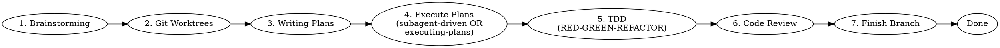

# Using SuperCleudocode (SuperSkills)

## Overview

**SuperCleudocode** is a complete software development workflow built on composable "super-skills" with automatic triggers.

**Core Principle:** Every development task follows a proven process that maximizes quality while minimizing technical debt.

## Quick Start

```bash
# Activate SuperCleudocode mode
@supercleudocode

# Or let skills auto-trigger based on context
```

## The SuperSkills Workflow

### Development Cycle



### Skill Activation Order

| Step | Skill | Trigger | Behavior |
|------|-------|---------|----------|
| 1 | **brainstorming** | Before writing code | Refines ideas, explores alternatives, presents design for validation |
| 2 | **using-git-worktrees** | After design approval | Creates isolated workspace, verifies clean baseline |
| 3 | **writing-plans** | With approved design | Breaks work into 2-5 minute tasks with exact paths |
| 4 | **subagent-driven-development** OR **executing-plans** | With plan | Dispatches subagents per task OR executes in batches |
| 5 | **test-driven-development** | During implementation | Enforces RED-GREEN-REFACTOR cycle |
| 6 | **requesting-code-review** | Between tasks | Reviews against plan, reports issues |
| 7 | **finishing-a-development-branch** | When tasks complete | Verifies tests, presents merge options |

## Available SuperSkills

### Testing
| Skill | Description |
|-------|-------------|
| **test-driven-development** | RED-GREEN-REFACTOR cycle with zero exceptions |

### Debugging
| Skill | Description |
|-------|-------------|
| **systematic-debugging** | 4-phase root cause analysis process |
| **verification-before-completion** | Ensure it's actually fixed before declaring done |

### Collaboration
| Skill | Description |
|-------|-------------|
| **brainstorming** | Socratic design refinement before any creative work |
| **writing-plans** | Detailed implementation plans with bite-sized tasks |
| **executing-plans** | Batch execution with human checkpoints |
| **dispatching-parallel-agents** | Concurrent subagent workflows |
| **requesting-code-review** | Pre-review checklist and severity reporting |
| **receiving-code-review** | Responding to feedback systematically |
| **using-git-worktrees** | Parallel development in isolated branches |
| **finishing-a-development-branch** | Merge/PR decision workflow |
| **subagent-driven-development** | Fast iteration with two-stage review |

### Meta
| Skill | Description |
|-------|-------------|
| **writing-super-skills** | Create new super-skills following best practices |
| **using-supercleudocode** | This skill - introduction to the system |

## Core Principles

### 1. Test-Driven Development
**Write tests FIRST. Always.**

```bash
# ❌ WRONG: Code before test
Write code → Write test → Test passes → "Done"

# ✅ RIGHT: Test before code
Write failing test → Watch it fail → Write minimal code → Watch it pass → Refactor
```

### 2. Systematic Over Ad-Hoc
**Process over guessing.**

```bash
# ❌ WRONG: Random debugging
"Let me try this..." → "Maybe this?" → "What if...?"

# ✅ RIGHT: Systematic approach
Reproduce → Isolate → Hypothesize → Test → Fix → Verify
```

### 3. Complexity Reduction
**Simplicity is the primary goal.**

```bash
# ❌ WRONG: Over-engineering
class AbstractFactoryBuilderPattern { ... }

# ✅ RIGHT: Simple solution
function createWidget(config) { return { ... } }
```

### 4. Evidence Over Claims
**Verify before declaring success.**

```bash
# ❌ WRONG: "It should work"
"I tested it manually" → "Works on my machine"

# ✅ RIGHT: Prove it
Tests passing → CI green → Performance benchmarks met → Documented
```

## The Iron Laws

### Law 1: No Code Before Test
```
Production code written BEFORE test? DELETE IT. Start over.

No exceptions:
- Don't keep it as "reference"
- Don't "adapt" it while writing tests
- Don't look at it
- Delete means DELETE
```

### Law 2: No Implementation Before Design
```
Code written before design approval? DELETE IT. Start over.

Design must include:
- Purpose and goals
- Alternatives considered
- Trade-offs analyzed
- User approval per section
```

### Law 3: No Merge Before Review
```
PR created before code review? CANCEL IT. Start over.

Review must cover:
- Spec compliance (does it match the plan?)
- Code quality (clean, tested, maintainable?)
- Security (no vulnerabilities?)
- Performance (benchmarks if applicable?)
```

## Common Workflows

### New Feature
```bash
1. @brainstorming          # Refine idea, get design approval
2. *git-worktree feature   # Create isolated branch
3. @writing-plans          # Break into tasks
4. @subagent-driven-development  # Execute with subagents
5. *request-review         # Review each task
6. *finish-branch          # Merge and cleanup
```

### Bug Fix
```bash
1. @systematic-debugging   # Find root cause
2. @brainstorming          # Design fix
3. *git-worktree fix       # Create isolated branch
4. @test-driven-development # Write failing test, fix
5. *verification-before-completion  # Verify fix
6. *request-review         # Review
7. *finish-branch          # Merge
```

### Refactoring
```bash
1. @brainstorming          # Understand scope, design approach
2. *git-worktree refactor  # Create isolated branch
3. @writing-plans          # Plan incremental changes
4. @executing-plans        # Execute with checkpoints
5. *test                   # Ensure all tests pass
6. *request-review         # Review
7. *finish-branch          # Merge
```

## MADMAX Integration

SuperCleudocode integrates with the **MADMAX** agent for maximum automation:

```bash
# MADMAX orchestrates the entire workflow
@madmax *orchestrate new-feature

# MADMAX delegates to specialized skills
@madmax *delegate @brainstorming "design auth system"
@madmax *delegate @testing "create test suite"
@madmax *delegate @code-review "review PR #42"

# MADMAX coordinates parallel execution
@madmax *coordinate @dev @testing @code-review
```

## Quality Gates

Every task must pass:

| Gate | Requirement |
|------|-------------|
| **Tests** | ≥80% coverage, all passing |
| **Lint** | No errors, warnings addressed |
| **Type Check** | No type errors |
| **Security** | No critical vulnerabilities |
| **Code Review** | Approved by specialist |
| **Performance** | Benchmarks met (if applicable) |

## Anti-Patterns to Avoid

| Anti-Pattern | Reality |
|--------------|---------|
| "Too simple to test" | Simple code breaks too. Test takes 30 seconds. |
| "I'll test after" | Tests passing immediately prove nothing. |
| "Works on my machine" | CI is the truth. |
| "I already manually tested" | Manual tests aren't reproducible. |
| "This is different because..." | It's not. Follow the process. |

## Red Flags

**STOP and start over if:**

- Code written before test
- "I already manually tested it"
- "Tests after achieve the same purpose"
- "It's about spirit not ritual"
- "This is different because..."

**All of these mean: Delete code. Start over with the process.**

## Configuration

### Enable Auto-Triggers

```json
{
  "supercleudocode": {
    "autoTrigger": true,
    "skills": {
      "test-driven-development": true,
      "brainstorming": true,
      "writing-plans": true,
      "systematic-debugging": true
    }
  }
}
```

### Skill Priority

```json
{
  "skillPriority": [
    "brainstorming",
    "using-git-worktrees",
    "writing-plans",
    "subagent-driven-development",
    "test-driven-development",
    "requesting-code-review",
    "finishing-a-development-branch"
  ]
}
```

## Getting Help

### List Active Skills
```bash
*skills list
```

### Check Skill Status
```bash
*skills status
```

### Force Trigger Skill
```bash
@skill-name
```

### View Skill Documentation
```bash
*skills show test-driven-development
```

## Real-World Impact

Teams using SuperCleudocode report:

- **70% fewer bugs** in production
- **50% faster** onboarding of new developers
- **90% reduction** in hotfixes
- **Consistent** code quality across the team

## Next Steps

1. **Start with brainstorming** - Before your next feature, use `@brainstorming`
2. **Try TDD** - Use `@test-driven-development` for your next bug fix
3. **Write a plan** - Use `@writing-plans` to break down complex tasks
4. **Request review** - Use `@requesting-code-review` before merging

---

**Version**: 1.0.0
**License**: MIT
**Repository**: https://github.com/cleudocode/cleudocodehub.skill

```
— SuperCleudocode, elevating development 🚀

"Skills are shortcuts to excellence."
```
