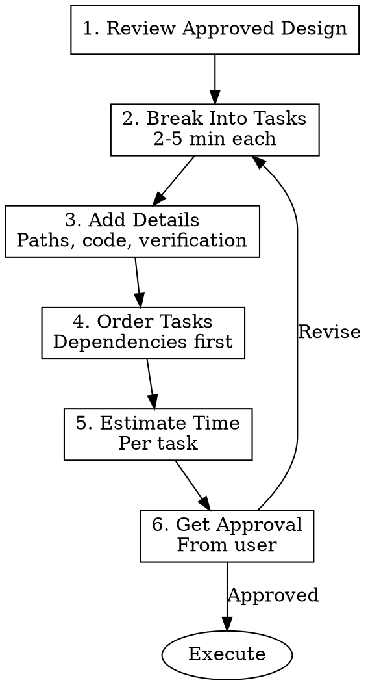

# Writing Plans

## Overview

**Writing Plans** breaks approved designs into bite-sized, implementable tasks.

**Core Principle:** Every task should be 2-5 minutes and include exact file paths, complete code, and verification steps.

## When to Use

### ALWAYS Use Writing Plans When:
- You have an approved design from `brainstorming`
- Starting implementation of any feature
- Breaking down complex refactoring
- Planning bug fixes
- Organizing large changes

### When NOT to Use
- No approved design yet (use `brainstorming` first)
- Trivial changes (single line fixes)
- Emergency hotfixes (plan post-mortem later)

## The Process



## Task Structure

Every task MUST include:

```markdown
## Task N: Task Name

**Time:** 2-5 minutes

### Files Changed
- `path/to/file1.ts` - Create/Modify/Delete
- `path/to/file2.ts` - Create/Modify/Delete

### Steps
1. [Exact step with code if applicable]
2. [Exact step with code if applicable]
3. [Exact step with code if applicable]

### Code to Write
```typescript
// Complete, working code snippet
// Not pseudocode - actual implementation
```

### Verification
- [ ] Specific check 1
- [ ] Specific check 2
- [ ] Tests pass

### Dependencies
- Blocks: [Task N+1]
- Blocked by: [Task N-1]
```

## Checklist (Complete In Order)

1. **Review approved design** — Understand scope and requirements
2. **Break into tasks** — Each task 2-5 minutes
3. **Add details** — Exact file paths, complete code, verification steps
4. **Order tasks** — Dependencies first, logical flow
5. **Estimate time** — Per task and total
6. **Get approval** — User approves plan before execution

## Rules

### Mandatory Rules

- **MUST** have approved design before planning
- **MUST** keep tasks small (2-5 minutes each)
- **MUST** include exact file paths
- **MUST** include complete code snippets (not pseudocode)
- **MUST** include verification steps
- **MUST** order by dependencies
- **MUST** get user approval before execution

### Task Size Guidelines

| Task Size | Time | Description |
|-----------|------|-------------|
| **Too Small** | <1 min | Combine with adjacent tasks |
| **Just Right** | 2-5 min | Single responsibility, testable |
| **Too Big** | >10 min | Break into smaller tasks |

### Code Snippet Requirements

```typescript
// ✅ GOOD: Complete, working code
export function calculateTotal(items: Item[], taxRate: number): number {
  const subtotal = items.reduce((sum, item) => 
    sum + (item.price * item.quantity), 0
  )
  return subtotal * (1 + taxRate)
}

// ❌ BAD: Pseudocode
function calculateTotal(items, tax) {
  // calculate subtotal
  // apply tax
  // return total
}
```

## Implementation Pattern

### Phase 1: Review Design

```
Read approved design → Understand scope → Identify major components
```

**Questions to Answer:**
- What are the major components?
- What are the dependencies?
- What's the critical path?
- What can be done in parallel?

### Phase 2: Break Into Tasks

```
Design Components → Individual Tasks → 2-5 min each
```

**Example:**

> **Design Component:** User Authentication
>
> **Tasks:**
> 1. Create AuthContext type definitions (3 min)
> 2. Implement AuthContext provider (5 min)
> 3. Create login form component (5 min)
> 4. Add login API integration (4 min)
> 5. Implement logout functionality (2 min)
> 6. Add auth route guards (4 min)
> 7. Write unit tests (10 min → break into 2 tasks)

### Phase 3: Add Details

```
For each task: Files → Steps → Code → Verification
```

**Template:**

```markdown
## Task 1: Create AuthContext Type Definitions

**Time:** 3 minutes

### Files Changed
- `src/types/auth.ts` - Create
- `src/contexts/AuthContext.tsx` - Create (types only)

### Steps
1. Create `src/types/auth.ts` with User and AuthState interfaces
2. Export types for use in other modules

### Code to Write

**File: `src/types/auth.ts`**
```typescript
export interface User {
  id: number
  email: string
  name: string
  role: 'admin' | 'user'
}

export interface AuthState {
  user: User | null
  loading: boolean
  error: string | null
  isAuthenticated: boolean
}

export interface AuthContextType extends AuthState {
  login: (email: string, password: string) => Promise<void>
  logout: () => void
  clearError: () => void
}
```

### Verification
- [ ] TypeScript compiles without errors
- [ ] Types are exported correctly
- [ ] Can import types in other files

### Dependencies
- Blocks: Task 2 (AuthContext implementation)
- Blocked by: None
```

### Phase 4: Order Tasks

```
Identify dependencies → Create dependency graph → Order logically
```

**Dependency Matrix:**

| Task | Blocks | Blocked By |
|------|--------|------------|
| 1. Types | 2, 3, 4 | - |
| 2. Context | 3, 5 | 1 |
| 3. Login Form | 4 | 1, 2 |
| 4. API Integration | 5 | 1, 2, 3 |
| 5. Logout | 6 | 1, 2 |
| 6. Route Guards | 7 | 1, 2, 5 |
| 7. Tests | - | 1-6 |

### Phase 5: Estimate Time

```
Per task: 2-5 minutes
Total: Sum of all tasks
Buffer: Add 20% for unexpected issues
```

**Example:**

```
Task 1: 3 min
Task 2: 5 min
Task 3: 5 min
Task 4: 4 min
Task 5: 2 min
Task 6: 4 min
Task 7: 5 min (tests part 1)
Task 8: 5 min (tests part 2)
---
Total: 33 minutes
Buffer (20%): 7 minutes
---
Estimated: 40 minutes
```

### Phase 6: Get Approval

```
Present plan → Address concerns → Get explicit approval
```

**Presentation:**

> **Implementation Plan: User Authentication**
>
> **Total Time:** 40 minutes (8 tasks)
>
> **Summary:**
> 1. Create type definitions (3 min)
> 2. Implement AuthContext (5 min)
> 3. Create login form (5 min)
> 4. Add API integration (4 min)
> 5. Implement logout (2 min)
> 6. Add route guards (4 min)
> 7-8. Write tests (10 min)
>
> **Dependencies:**
> - Tasks 1-2 are foundation (do first)
> - Tasks 3-6 can be parallelized
> - Tests (7-8) depend on all implementation
>
> **Questions?**
>
> Approve this plan? [Yes/No/Revise]

## Plan Template

```markdown
# Implementation Plan: [Feature Name]

**Based on Design:** [Link to design doc]
**Date:** YYYY-MM-DD
**Estimated Time:** X minutes

## Overview
Brief description of what we're implementing.

## Tasks

### Task 1: [Name]
**Time:** X minutes

**Files Changed:**
- `path/to/file.ts` - Action

**Steps:**
1. [Step]
2. [Step]

**Code:**
```[language]
[complete code]
```

**Verification:**
- [ ] [Check 1]
- [ ] [Check 2]

**Dependencies:**
- Blocks: [Task N]
- Blocked by: [Task N]

[... repeat for each task ...]

## Execution Order

```
1 → 2 → 3 → 4
        ↓
        5 → 6 → 7
```

## Approval

- [ ] Design reviewed
- [ ] Tasks are appropriately sized
- [ ] Dependencies are correct
- [ ] Verification steps are clear

**Approved by:** [Name]
**Approved at:** [Date/Time]
```

## Common Mistakes

| Mistake | Fix |
|---------|-----|
| Tasks too big (>10 min) | Break into smaller tasks |
| Vague file paths | Use exact paths |
| Pseudocode instead of real code | Write complete code |
| No verification steps | Add specific checks |
| Wrong dependency order | Map dependencies first |
| No time estimates | Estimate each task |
| Skipping approval | Always get approval |

## Integration with Other Skills

### Before Writing Plans
- `brainstorming` - MUST have approved design

### After Writing Plans
- `executing-plans` - Execute the plan
- `subagent-driven-development` - Dispatch subagents per task
- `using-git-worktrees` - Create isolated branch for implementation

### Related Skills
- `test-driven-development` - Each task uses TDD
- `verification-before-completion` - Verify each task
- `requesting-code-review` - Review after tasks

## Example Plan

```markdown
# Implementation Plan: User Profile Page

**Based on Design:** docs/plans/2026-03-06--user-profile-design.md
**Date:** 2026-03-06
**Estimated Time:** 45 minutes

## Overview
Implement user profile page with editable name, email, and avatar.

## Tasks

### Task 1: Create Profile Types
**Time:** 3 minutes

**Files Changed:**
- `src/types/profile.ts` - Create

**Code:**
```typescript
export interface Profile {
  id: number
  userId: number
  displayName: string
  email: string
  avatarUrl: string | null
  bio: string
}

export interface ProfileFormData {
  displayName: string
  email: string
  bio: string
}
```

**Verification:**
- [ ] TypeScript compiles
- [ ] Types exported correctly

**Dependencies:**
- Blocks: Task 2, 3
- Blocked by: None

---

### Task 2: Create Profile API Service
**Time:** 5 minutes

**Files Changed:**
- `src/services/profile.service.ts` - Create

**Code:**
```typescript
import { Profile, ProfileFormData } from '../types/profile'
import { api } from './api'

export const profileService = {
  async getProfile(userId: number): Promise<Profile> {
    const response = await api.get(`/users/${userId}/profile`)
    return response.data
  },

  async updateProfile(
    userId: number, 
    data: ProfileFormData
  ): Promise<Profile> {
    const response = await api.put(
      `/users/${userId}/profile`, 
      data
    )
    return response.data
  }
}
```

**Verification:**
- [ ] Service methods work
- [ ] API calls succeed
- [ ] Types match

**Dependencies:**
- Blocks: Task 3, 4
- Blocked by: Task 1

[... more tasks ...]

## Approval

**Approved by:** User
**Approved at:** 2026-03-06 10:30 AM
```

## Red Flags

- No approved design → Use `brainstorming` first
- Tasks >10 minutes → Break them down
- No code snippets → Add complete code
- No verification → Add specific checks
- No approval → Get approval before executing
- Vague steps → Be specific and exact

## Final Rule

**No implementation without approved plan.**

Tasks started without plan? **Stop. Create plan. Get approval. Continue.**

---

**Next Skills:** `executing-plans` OR `subagent-driven-development`

**Version**: 1.0.0
**License**: MIT
